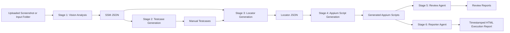
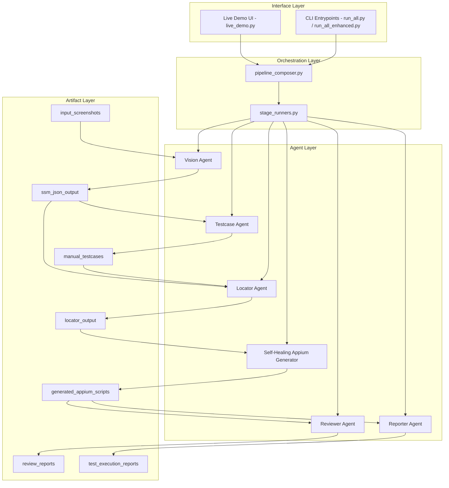

# Mobile Test Generator - Capstone Project

An end-to-end automation pipeline that converts mobile app screenshots into:

- structured SSM JSON,
- manual test cases,
- multi-strategy locator files,
- generated Appium scripts,
- review reports, and
- executed test HTML reports.

## Project Structure

```text
Project13_Captstone/
|-- agents/                            # AI and generation agents (vision, locator, appium, reviewer)
|-- artifacts/                         # Runtime outputs (kept via .gitkeep, generated at run time)
|   |-- input_screenshots/
|   |-- ssm_json_output/
|   |-- manual_testcases/
|   |-- locator_output/
|   |-- generated_appium_scripts/
|   |-- review_reports/
|   |-- test_execution_reports/
|-- config/                            # App configuration and environment-backed settings
|-- models/                            # Domain models (for example Screen Semantic Model)
|-- pipelines/                         # Stage runners and orchestration entry points
|   |-- run_all.py
|   |-- run_all_enhanced.py
|   |-- pipeline_composer.py
|   |-- stage_runners.py
|-- prompts/                           # Prompt templates used by agents
|-- services/                          # Shared services (config, prompt manager, llm client)
|-- tests/                             # Unit/integration tests and snapshots
|-- utils/                             # Self-healing and shared Appium session utilities
|-- web/
|   |-- templates/live_demo.html       # Live demo UI
|-- live_demo.py                       # Flask upload UI + enhanced pipeline execution
|-- README.md
|-- LIVE_DEMO_RUN_STEPS.md
|-- CHANGES_FROM_INITIAL_PRIYANKA_BASELINE.md
```

Important artifact folders:

- artifacts/input_screenshots/
- artifacts/ssm_json_output/
- artifacts/manual_testcases/
- artifacts/locator_output/
- artifacts/generated_appium_scripts/
- artifacts/review_reports/
- artifacts/test_execution_reports/

## Architecture Overview

The platform follows a staged artifact-driven architecture. Each stage writes outputs to an artifact folder and the next stage consumes those artifacts.



## System Architecture Diagram



## Component Responsibilities

- `live_demo.py`
	- Hosts Flask UI for screenshot upload and run trigger.
	- Starts Appium if needed.
	- Runs enhanced pipeline and exposes per-run artifact links.
	- Uses strict run-delta filtering so results only show files produced by the current upload.

- `pipelines/pipeline_composer.py`
	- Central orchestrator for the 6-stage flow.
	- Handles stage ordering and directory reset behavior for deterministic runs.

- `pipelines/stage_runners.py`
	- Implements reusable stage classes (Vision, Testcase, Locator, Appium, Review, Report).
	- Shared by standard and enhanced pipeline entrypoints.

- `agents/self_healing_appium_generator.py`
	- Generates robust Appium scripts with multi-strategy locator healing.
	- Startup stabilization uses explicit wait behavior (no hardcoded sleep in generated flow).

- `agents/reviewer_agent.py`
	- Reviews generated scripts for common anti-patterns.
	- Produces markdown reports in `artifacts/review_reports/`.

## Setup

### 1) Create and activate virtual environment

Windows PowerShell:

```powershell
Set-Location C:\Users\ankit.kulchandani\Desktop\Apexon\Project13_Captstone
.\scripts\setup_env.ps1 -PythonExe python
.\.venv\Scripts\Activate.ps1
```

macOS or Linux:

```bash
cd /path/to/Project13_Captstone
bash scripts/setup_env.sh
source .venv/bin/activate
```

Recommended Python version: 3.11 or 3.12.

### 2) Configure environment variables

Use .env for provider configuration.

Real-provider example:

```dotenv
VISION_AGENT_PROVIDER=openai
TESTCASE_AGENT_PROVIDER=openai
OPENAI_API_KEY=your_api_key_here
OPENAI_MODEL=gpt-4o-mini
OPENAI_API_BASE=https://api.openai.com/v1
```

Mock-provider example:

```dotenv
VISION_AGENT_PROVIDER=mock
TESTCASE_AGENT_PROVIDER=mock
```

## Running the Pipeline

### Recommended: Enhanced all-steps run

```powershell
python pipelines/run_all_enhanced.py artifacts/input_screenshots
```

Without auto-opening report:

```powershell
python pipelines/run_all_enhanced.py artifacts/input_screenshots --no-browser
```

### Standard all-steps run

```powershell
python pipelines/run_all.py artifacts/input_screenshots
```

Execution modes:

- `run_all.py`: baseline pipeline behavior.
- `run_all_enhanced.py`: preferred mode with latest orchestration/stability improvements.
- `live_demo.py`: upload-driven walkthrough mode for stakeholders.

## Live Demo Mode (HTML Upload UI)

Run the local demo UI:

```powershell
python live_demo.py
```

Open http://127.0.0.1:8080 and:

1. Upload one screenshot (png, jpg, jpeg, webp, bmp).
2. Select mock or real mode.
3. Run the demo.
4. Review generated artifacts and open report links from the page.

Current live demo behavior:

- stores uploads under artifacts/input_screenshots/live_demo_uploads/<timestamp>/,
- attempts to auto-start Appium when needed,
- runs the enhanced pipeline,
- resets manual testcase artifacts before Stage 2 so downstream generation uses only the current upload run,
- shows run-scoped artifacts in the results (no historical testcase carry-over),
- computes artifact lists using pre-run folder snapshots plus post-run deltas, so scripts/reviews/locators shown in UI are only from the current uploaded screenshot run,
- hides non-user artifacts such as .gitkeep, hidden files, .pyc, and __pycache__ from result panels,
- displays pipeline logs and stderr in the UI,
- uses a cleaner header layout (removed non-functional stats section),
- supports compact filename display in result sections.

## Running Individual Steps

Step 1 - Screenshots to SSM JSON:

```powershell
python pipelines/ssm_generator.py artifacts/input_screenshots artifacts/ssm_json_output --clean
```

Step 2 - SSM JSON to manual test cases:

```powershell
python pipelines/testcase_generator.py artifacts/ssm_json_output artifacts/manual_testcases --clean
```

Step 3 - SSM JSON to locator JSON: via LocatorAgent pipeline stage.

Step 4 - Locator JSON to Appium scripts: via AppiumGeneratorAgent pipeline stage.

Step 5 - Appium scripts to review reports: via ReviewerAgent pipeline stage.

Step 6 - Run tests and create HTML report:

```powershell
python pipelines/reporter.py
python pipelines/reporter.py artifacts/generated_appium_scripts
```

Report output format:

- artifacts/test_execution_reports/YYYY-MM-DD_HH-MM-SS/report.html

## Current Notable Updates on Main

- Live demo run scoping and UI readability were improved in `live_demo.py`, `pipelines/pipeline_composer.py`, and `web/templates/live_demo.html`.
- The live demo no longer reuses historical manual testcase files during a new run.
- The old decorative "Input Type / Pipeline / Output Scope" section was removed from the page.
- Artifact panels now use strict per-run delta filtering, so old generated scripts and review reports are not shown for new uploads.
- Self-healing script startup stabilization removed hardcoded sleep in generator output and relies on explicit wait logic.

## Supported Image Formats

- png
- jpg
- jpeg
- webp
- bmp

## Running Tests

```powershell
python -m unittest tests.test_ssm_model
```

## Architecture Notes

- Stages are loosely coupled and communicate through artifact contracts.
- Providers are swappable between openai and mock via environment settings.
- Prompts are externalized in `prompts/` and can be tuned without code changes.
- Reporter output is timestamped for traceable test execution history.
- Live demo output lists are run-scoped and filtered for user-facing artifacts only.
